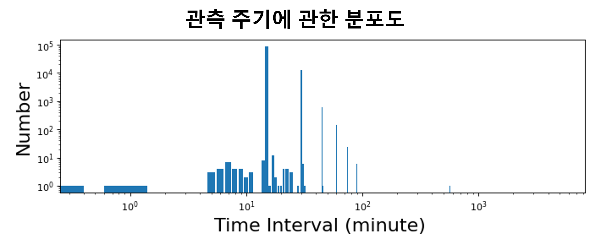

# 영상 기반 유사사례 검색: 샘플 코드 및 데이터

## 1. 개요
### 목표
- 심층학습 기반 영상 패턴 추출 기술 개발
- K-최근접 이웃그래프 기반 검색 기술 개발
- 심층학습 기반 초단기 영상 예측 기술 개발
- 비지도 학습 기반 이상 탐지 기술 개발

### 필요성
- 유사 벡터 탐색의 높은 정확도 (유사도 지표 기준 0.80 이상)
- 실시간 검색 기능

### 의의
- 방대한 양의 누적된 데이터에서 실시간으로 유사사례 검색 가능
- 유사 사례 참고를 통한 예보 품질 향상
- 실시간 영상 패턴 인식 및 위험 기상 사전 탐지 가능

## 2. 데이터셋

### COMS 위성 이미지 예시

COMS 위성에서 4개의 다른 채널이 보여주는 이미지 예시

<p align="left">
  
  
  
  
</p>

### 데이터셋 설명 표

모든 위성 데이터에 대해 살펴본 결과를 다음과 같이 정리함.

|위성|파일 크기|기간|채널 종류|관측 주기|이미지 크기|이미지파일 형태|
|:-----:|:-----:|:-----:|:-----:|:-----:|:-----:|:-----:|
|**COMS**|2,021GB|2010-2020|4|15분|(1300,1500,3)|png|
|**GK2A**|3,449GB|2017-2021|16|10분|(1332,1500,3)|png|
|**GMS5**|17GB|1991-2003|3|3시간|(512,512,4)|gif|
|**Himawari**|5,876GB|2015-2021|14|10분|(1300,1500,3)|png|
|**MTSAT1R**|64GB|2010-2014|4|15분-1시간|(1300,1500,3)|png|
|**MTSAT2**|445GB|2010-2015|4|15분-1시간|(1300,1500,3)|png|

### 데이터셋 링크

NAS 링크

### 데이터셋 분석 

COMS 위성 이미지 파일을 예시로, 데이터셋 분석을 위한 코드를 제공함 [(jupyternotebook)](Analyze_COMS.ipynb).

1. 유효한 이미지 분포 파악
2. 관측 주기에 관한 분포 분석
3. 6시간 길이의 비디오를 구성하기에 적절한 이미지 개수 분석
    


## 3. 유사도 지표
### 영상 유사도 지표: 격자 기반 정렬
1. 이미지를 N x N 격자로 분할.
2. 각 격자 내의 픽셀 값을 B개의 구간으로 나누어진 분포료 표현.
3. 격자 간의 (1 - D-statistic) 계산하여 유사도 측정.
4. 격자 간의 유사도 평균으로 이미지 간의 유사도 측정.
5. 이미지 간의 유사도 평균으로 영상 간의 유사도 측정.

<p align="center">
  
</p>

### 예시
- (**왼쪽**) 2012년 10월 27일 14시 15분 / (**가운데**) 2012년 10월 27일 16시 45분 / (**오른쪽**) 2012년 12월 22일 01시 00분
- **왼쪽**과 **가운데**의 유사도 = **0.807**
- **왼쪽**과 **오른쪽**의 유사도 = **0.354**

<p align="center">
  
  
  
</p>

### 실행 방법
- [ground_truth](https://github.com/geonlee0325/weather_similarity/tree/main/ground_truth) 폴더에 있는 3개의 예시 영상 [video_1](https://github.com/geonlee0325/weather_similarity/tree/main/ground_truth/video_1), [video_2](https://github.com/geonlee0325/weather_similarity/tree/main/ground_truth/video_2), [video_3](https://github.com/geonlee0325/weather_similarity/tree/main/ground_truth/video_3) 참고
- 격자 개수(**N**)과 픽셀 분포의 구간 개수(**B**)를 다음과 같이 설정하여, 다음과 같이 [main.cpp](https://github.com/geonlee0325/weather_similarity/tree/main/ground_truth/main.cpp) C++ 코드를 컴파일 및 실행:
```
컴파일: g++ -o run main.cpp 
실행  : ./run [Video1의 경로] [Video2의 경로] [격자개수 N] [분포구간개수 B]
```
- 실행 예시:
```
입력: ./run video_1 video_2 24 20
출력: 0.807409

입력: ./run video_1 video_3 24 20
출력: 0.354187
```

## 4. 전처리

### 이미지 전처리 
 
* 이미지 너비 및 높이 모두 300 픽셀 이상이 되는 최소한의 크기로 줄임.
* 줄이고자 하는 이미지를 *rawdatapath* 로 지정한 뒤, 줄여진 이미지를 저장할 폴더를 *outputpath*로 지정하여 줄일 수 있는 코드를 제공함 [(jupyternotebook)](preprocess_image.ipynb).
* 예시로, [Raw Image](raw_images/201103030645_image/) 를 줄여 [Reduced Image](reduced_images/201103030645_image/) 로 저장함.

<p align="center">
  
</p>

### 비디오 전처리

* 비디오를 구성하는 이미지 개수를 20개로 통일하게 위해 무작위 선택을 적용함.
* 예시로, [RawImages](raw_images/) 폴더에 있는 이미지로 6시간 길이의 비디오를 생성하는 방식의 코드를 제공함 [(jupyternotebook)](preprocess_video.ipynb).

<p align="center">
  
</p>


## 5. 모델 학습 
### 심층 메트릭 학습을 통한 이미지 유사도 학습
- 이미지 간의 유사도가 다차원 영상 벡터 간의 유사도에서 유지되도록 학습

<p align="center">
  
</p>

- 모델 구조는 다음과 같이 설계:
  1. 각 채널 이미지를 [flatten](https://pytorch.org/docs/stable/generated/torch.flatten.html)하여 112,500차원 벡터로 표현.
  2. 채널별로 독립적인 인코더를 통과하여 32차원 벡터로 표현.
  3. 채널별 벡터를 [concatenate](https://pytorch.org/docs/stable/generated/torch.cat.html)하여 이미지를 128차원 벡터로 표현.
  4. 20개의 이미지를 [mean](https://pytorch.org/docs/stable/generated/torch.mean.html)하여 영상을 128차원 벡터로 표현.

<p align="center">
  
</p>

- 손실함수로는 [Log-Ratio Loss](https://openaccess.thecvf.com/content_CVPR_2019/papers/Kim_Deep_Metric_Learning_Beyond_Binary_Supervision_CVPR_2019_paper.pdf) 활용

<p align="center">
  
</p>

### 학습 / 검증 / 평가 데이터
#### 데이터 다운로드
- **2013년 1월 1일 00시 00분**부터 **2013년 1월 7일 23시 45분**까지의 **전처리된** 567개의 영상 
- 이미지를 [구글 드라이브](https://drive.google.com/file/d/1ct4O3C5-gJUBp7j2AxSdM3-2KQIuUXNy/view?usp=sharing)에서 다운로드하여 [sample_code](https://github.com/geonlee0325/weather_similarity/blob/main/sample_code/)에 옮긴 후 압축해제:
```
unzip images.zip
```
- i-번째 이미지는 ```images/image_[i]```에 폴더에 저장됨.

#### 데이터 이해
- 각 영상을 구성하는 20장의 이미지 ([video2image.txt](https://github.com/geonlee0325/weather_similarity/blob/main/sample_code/video2image.txt)):
```
예시:
19,20,21,22,23,24,25,27,28,29,30,31,32,33,34,35,36,38,39,40
20,21,22,23,24,25,26,28,29,30,31,32,33,34,35,36,37,38,39,40
21,22,23,24,26,27,28,29,30,31,32,33,34,35,36,37,38,39,40,41
```
- 567개의 영상을 **20:20:60**의 비율로 나눈 학습 데이터 ([train.txt](https://github.com/geonlee0325/weather_similarity/blob/main/sample_code/train.txt)), 검증 데이터 ([valid.txt](https://github.com/geonlee0325/weather_similarity/blob/main/sample_code/valid.txt)), 평가 데이터 ([test.txt](https://github.com/geonlee0325/weather_similarity/blob/main/sample_code/test.txt)) 
- 각 데이터는 ```[영상 1]<tab>[영상 2]<tab>[영상 3]<tab>[영상 1과 영상 2의 유사도]<tab>[영상 1과 영상 3의 유사도]``` 형태:
```
예시:
350	347	383	0.891016	0.541287
498	499	95	0.954669	0.439012
80	84	81	0.832623	0.925232
```

### 모델 실행 방법 설명
- [sample_code](https://github.com/geonlee0325/weather_similarity/blob/main/sample_code) 폴더에 있는 [main.py](https://github.com/geonlee0325/weather_similarity/blob/main/sample_code/main.py)를 실행
- 실행 방법:
```
python main.py --epochs [학습횟수] --dim [벡터 차원] --learning_rate [학습률] --batch_size [배치 크기] --video_size [영상 길이] --log_path [로그 저장로] --gpu [GPU 번호] --N [격자 개수] --B [분포구간 개수]
```
- 실행 예시:
```
python main.py --epochs 100 --dim 128 --learning_rate 1e-5 --batch_size 32 --video_size 20 --log_path log.txt --gpu 0 --N 24 --B 20
```
- 실행 결과 1: 로그 저장로에 다음과 같이 학습 추이 기록
```
기록 예시:
epoch	1
loss	0.6586444973945618
runtime	5.312704086303711

epoch	2
loss	0.2081376053392887
runtime	4.766304016113281
```
- 실행 결과 2: models 폴더에 학습된 모델 저장
```
모델 로드 예시:
trained_model = torch.load(os.path.join('models', 'model_ep_100.pt'))
```

### 실행 결과
- 학습에 따른 **손실 (loss)** 변화
<p align="center">
  
</p>

- 영상 간의 유사도와 벡터 간의 거리 간의 **연관도 (Pearson Correlation)**
  - (**왼쪽**) 학습에 활용한 영상의 쌍의 연관도 = **-0.975**
  - (**오른쪽**) 학습에 활용하지 않은 영상의 쌍의 연관도 = **-0.955**
<p align="center">
  
  
</p>

- [평가 코드](https://github.com/geonlee0325/weather_similarity/blob/main/sample_code/evaluate.ipynb)를 참고 
