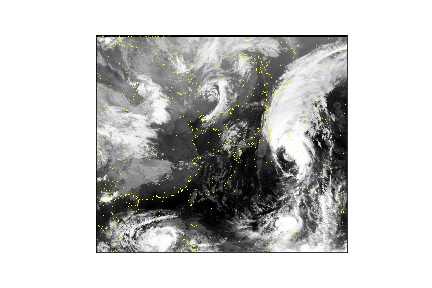

# 영상 기반 유사사례 검색: 샘플 코드 및 데이터

## 1. 개요
### 목표
- 심층학습 기반 영상 패턴 추출 기술 개발
- K-최근접 이웃그래프 기반 검색 기술 개발
- 심층학습 기반 초단기 영상 예측 기술 개발
- 비지도 학습 기반 이상 탐지 기술 개발

### 필요성
- 유사 벡터 탐색의 높은 정확도 (유사도 지표 기준 0.80 이상)
- 실시간 검색 기능

### 의의
- 방대한 양의 누적된 데이터에서 실시간으로 유사사례 검색 가능
- 유사 사례 참고를 통한 예보 품질 향상
- 실시간 영상 패턴 인식 및 위험 기상 사전 탐지 가능

## 2. 데이터셋 (TODO)
- 샘플 이미지
- 데이터셋 설명 표 (명세서)
- NAS 링크

## 3. 유사도 지표
### 영상 유사도 지표: 격자 기반 정렬
1. 이미지를 N x N 격자로 분할.
2. 각 격자 내의 픽셀 값을 B개의 구간으로 나누어진 분포료 표현.
3. 격자 간의 (1 - D-statistic) 계산하여 유사도 측정.
4. 격자 간의 유사도 평균으로 이미지 간의 유사도 측정.
5. 이미지 간의 유사도 평균으로 영상 간의 유사도 측정.

<p align="center">
  
</p>

### 예시
- (**왼쪽**) 2012년 10월 27일 14시 15분 / (**가운데**) 2012년 10월 27일 16시 45분 / (**오른쪽**) 2012년 12월 22일 01시 00분
- **왼쪽**과 **가운데**의 유사도 = **0.807**
- **왼쪽**과 **오른쪽**의 유사도 = **0.354**

<p align="center">
  
  
  
</p>

### 실행 방법
- [ground_truth](https://github.com/geonlee0325/weather_similarity/tree/main/ground_truth) 폴더에 있는 3개의 예시 영상 [video_1](https://github.com/geonlee0325/weather_similarity/tree/main/ground_truth/video_1), [video_2](https://github.com/geonlee0325/weather_similarity/tree/main/ground_truth/video_2), [video_3](https://github.com/geonlee0325/weather_similarity/tree/main/ground_truth/video_3) 참고
- 격자 개수(**N**)과 픽셀 분포의 구간 개수(**B**)를 다음과 같이 설정하여, 다음과 같이 [main.cpp](https://github.com/geonlee0325/weather_similarity/tree/main/ground_truth/main.cpp) C++ 코드를 컴파일 및 실행:
```
컴파일: g++ -o run main.cpp 
실행  : ./run [Video1의 경로] [Video2의 경로] [격자개수 N] [분포구간개수 B]
```
- 실행 예시:
```
입력: ./run video_1 video_2 24 20
출력: 0.807409

입력: ./run video_1 video_3 24 20
출력: 0.354187
```

## 4. 전처리 (TODO)
- 이미지 전처리 설명
- 비디오 전처리 설명
- 실행 방법 설명

## 5. 모델 학습 (TODO)
### 심층 메트릭 학습을 통한 이미지 유사도 학습
- 이미지 간의 유사도가 다차원 영상 벡터 간의 유사도에서 유지되도록 학습

<p align="center">
  
</p>

- 손실함수로는 [Log-Ratio Loss](https://openaccess.thecvf.com/content_CVPR_2019/papers/Kim_Deep_Metric_Learning_Beyond_Binary_Supervision_CVPR_2019_paper.pdf) 활용

<p align="center">
  
</p>

### 학습 / 검증 / 평가 데이터
- 

### 모델 실행 방법 설명
- 여기 설명

### 실행 결과
- 실행 결과 (correlation)
